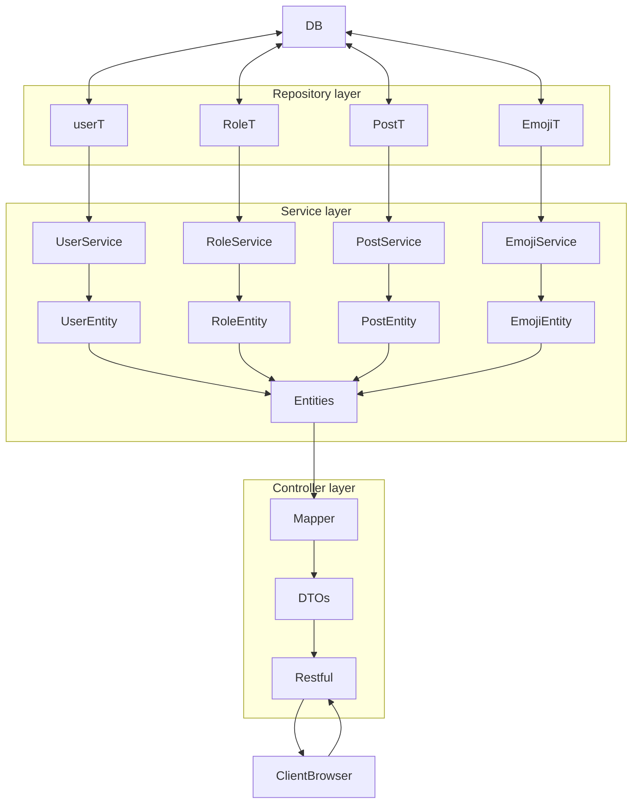

# features 

[[extra Note]]
## standard
- [x] account creation ✅ 2022-09-20
	- [ ] unique by user
- [ ] spring security
### good to have 
- [ ] theme : dark mode , light mode 

## admin 
- delete and update any post 
- delete and update any users

## users 
- [ ] create post 
	- [x] text ✅ 2022-09-20
	- [ ] upload file
	- [ ] provide link to media
- [ ] update post created by own self 
- [ ] delete your own post 

### post
- The system should be able to track the number of views for each post

## extra good to have 
- support global emojis
	-  all user can use
- support custom emoji
	- belonging only to 1 user that only he can use

## super super good to have ( not likely to do )
- reading data from external api/app ( have no decided yet )

# technologies used 

## backend 
spring boot 2.7.3
REST
## frontend 
angular  14

## database
mysql

# project models 

## user
- id 
- userName
- password
- name
- email 

## role 

## post ( created by user)
- id 
- title
- message
- foreign id (user)

## media
- id 
- file
- url 

# ORM
ManyToOne
- Post : User
OneToOne
- Role : User
- media :Post

## DTOs

### home page DTO

#### what is needed 
user
- name 

post 
- messages
- user:name
- postedTime

---

# pages/views

## user 
### user profile page 
#### what is needed 
user
- name
- email 
- password
- username
#### what can be done
- see user 's name , email 
- change password
- change email 
- change username
- change name

### user home page ( can see everyone 's post/feed')

#### what is needed 
user
- name 

post 
- messages
- user:name
- postedTime
#### what can done 
- user name is show 
- can post a quick  new post
- see all current post
- open a detail page to edit your post(good to have)
### 

# To do 
- [x] create post Service ✅ 2022-09-20
	- [x] able to view post ✅ 2022-09-20
- [ ] create user service 
	- [ ] able to register new user
	- [ ] able to create a new post
- [x] create HomePageDTO ✅ 2022-09-20